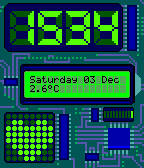

# Electric
Electronics inspired, interactive Pebble watchface made for the Rebble Hackaton #001

## Features & Updates:
v1.0:
- tell the time
- tell the date on LCD
- interactive 8x8 LED Dot Matrix (configurable via watchface settings)

v1.1
- improve the visibility of the electronic wires
- add battery indicator
- add lost-bluetooth-connection indicator (will show on LED Dot Matrix)
- add temperature to LCD (using openweather API key you set in settings)
- add support to modify LCD and Dot Matrix via Tasker(!)

## Interactivity with Tasker
Using Tasker intents it's actually possible to modify the LCD or LED Dot Matrix, giving you endless possibilities for this watchface!

### Set LCD 
1. Create a new task and select the 'Send Intent' action (Under System). 
2. Set Action to: `com.getpebble.action.app.SEND`
3. Set 1st Extra to: `uuid:595e1d90-ec79-4199-820d-09aea593309f`
4. Set 2nd Extra to: `transaction_id:-1`
5. Set 3rd Extra to: `msg_data:[{"key":10012,"type":"string","length":0,"value":"your message here"}]`

### Reset LCD
To reset the LCD to default (show date and temperature), follow the same 4 steps as above but replace step 5 with:

`msg_data:[{"key":10013,"type":"string","length":0,"value":1}]`

### Set LED Dot Matrix
To set the Dot Matrix, use the same 4 steps as mentioned earlier and replace step 5 with: 

`msg_data:[{"key":10011,"type":"string","length":0,"value":"0000000001100110111111111111111111111111011111100011110000011000
"}]`

The value field should be a 64 character string using only 0's and 1's.

### Examples
- Show the price of your favorite stock on the LCD: https://taskernet.com/shares/?user=AS35m8m%2FxB1%2FT873xL87mtAXOLmlxKc87toLJDt088HjC6l4%2FF%2FDf5f8qZurAPsvOYZ5wImto2OC0A%3D%3D&id=Task%3AGetgme
- Fetch the moonphase using your OpenWeather API key and show a relevant moon icon on the Dot Matrix:
https://taskernet.com/shares/?user=AS35m8m%2FxB1%2FT873xL87mtAXOLmlxKc87toLJDt088HjC6l4%2FF%2FDf5f8qZurAPsvOYZ5wImto2OC0A%3D%3D&id=Task%3AMoonphasepebble
